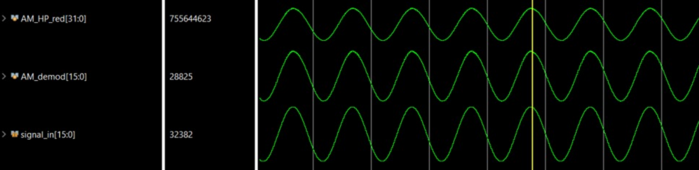

# ECE 529 Standard AM Demodulator on FPGA
This repository contains my standard AM modulation and demodulation code on FPGA. I wrote it for the digitial signal processing course ECE 529 at the University of Arizona. It uses digital filters and is tested with pure sine waves using the Xilinx DDS module.

## Hardware
This processor block was written for the [Digilent Nexys 4 board](https://digilent.com/reference/programmable-logic/nexys-4/start) containing the [Xilinx Artix-7 FPGA](https://www.xilinx.com/products/silicon-devices/fpga/artix-7.html), but it can be easily adapted to any other board and FPGA by modifying the contraint file [Two4DigitDisplay.xdc](constraints/Two4DigitDisplay.xdc). At the FPGA level, the block's inputs are the board oscillator pin as a clock and a push-button pin as a user reset button. The block's outputs are the pins for the 8-digit 7-segment display.

## Setup
The Verilog code was sucessfully sythesized and tested with the Artix-7 FPGA using the [Xilinx Vivado IDE](https://www.xilinx.com/products/design-tools/vivado.html). I would recommend creating a new project with the XC7A100T-1CSG324C FPGA target and copying the files into its source directory. [The top level file](sources/top_level.v) should be set as the top level block before running simulations or synthesis.

# Results
The process follows the standard AM modulation and demodulation chains. For modulation, the input signal is offset by its amplitude then multiplied with a high frequency carrier. For demodulation, the signal is rectified, then passed through an envelope detector, then low and high pass filters to remove noise and the DC offset.

